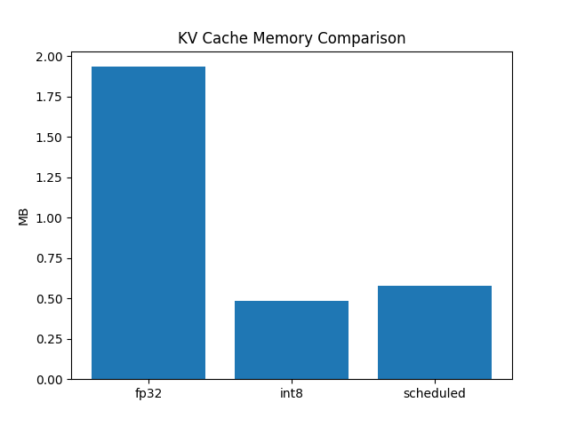
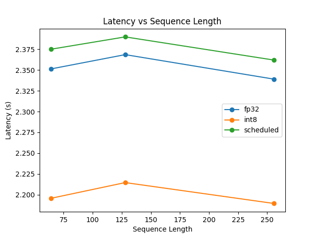
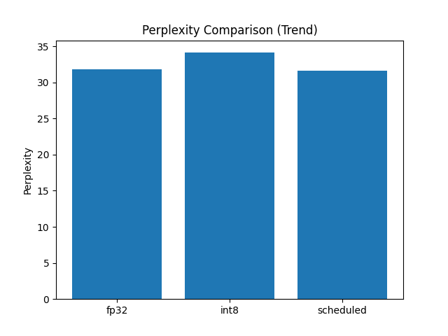
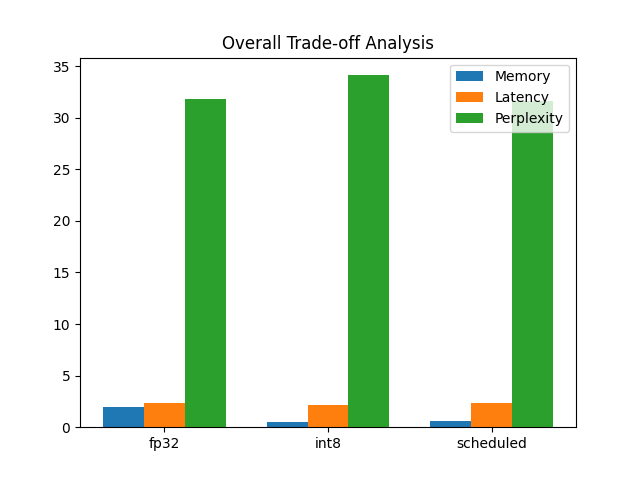

# Adaptive Precision KV Cache Optimization for Transformer Inference

**CS595 Final Project**

**Name: Rachana Vijay**
**A#: A20605843**

---

## Overview

This project proposes **Precision Scheduling** — a hybrid approach that keeps recent tokens in full FP32 precision (a *Freshness Window*) while compressing older tokens to INT8, based on the key observation that attention mechanisms are more sensitive to recent context than distant tokens.

### Key Contributions

- **Freshness Window**: The *N* most recent tokens are preserved in FP32 as high-fidelity structural anchors.
- **Temporal Decay**: Tokens aging beyond the window are quantized to INT8 on-the-fly.
- **Hybrid Reconstruction**: During attention computation, compressed entries are dequantized dynamically before the softmax-dot-product operation.
- **~70% KV cache memory reduction** with perplexity staying within 0.2 PPL of the FP32 baseline.

---

## Installation

### Prerequisites

- Python 3.10+
- PyTorch 2.1
- 8 GB RAM (CPU inference)

### Setup

```bash
# Clone the repository
git clone https://github.com/rvijay2/kv-cache-quantization.git

# Create and activate a virtual environment
python -m venv venv
# venv\Scripts\activate         # Windows

# Install dependencies
pip install -r requirements.txt
```

### Requirements

```
torch>=2.1.0
transformers>=4.35.0
datasets>=2.14.0
matplotlib>=3.7.0
numpy>=1.24.0
```

---

## Usage

### Run the Full Experiment

```bash
python run_experiment.py
```

This iterates over all three modes (`fp32`, `int8`, `scheduled`) and all configured sequence lengths, saving results to `results/output.json`.

**Expected terminal output:**
```
Running fp32 | seq_len=64
Running fp32 | seq_len=128
Running fp32 | seq_len=256
Running int8 | seq_len=64
...
Running scheduled | seq_len=256
Results saved.
```

### Generate Plots

```bash
python plot_results.py
```

Outputs four figures to `results/`:
- `latency.png` — Latency vs Sequence Length per mode
- `memory.png` — KV Cache Memory Comparison (bar chart)
- `perplexity.png` — Perplexity Comparison (bar chart)
- `tradeoff.png` — Combined trade-off visualization

### Configuration

Edit `config.py` to change experiment parameters:

```python
MODEL_NAME       = "gpt2"           # HuggingFace model ID
MODES            = ["fp32", "int8", "scheduled"]
SEQUENCE_LENGTHS = [64, 128, 256]
MAX_NEW_TOKENS   = 50               # Tokens to generate per run
FP32_TOKENS      = 10               # Freshness window size (steps in FP32)
```

---

## Architecture

### System Pipeline

```
Input Text
    │
    ▼
┌─────────────────────┐
│   GPT-2 Decoder     │  ← HuggingFace GPT2LMHeadModel
│   (Autoregressive)  │
└──────────┬──────────┘
           │  past_key_values
           ▼
┌─────────────────────┐
│  Precision Scheduler│  ← kv_scheduler.py
│                     │
│  step ≤ threshold?  │
│  ├── YES → FP32     │  (Freshness Window — full precision)
│  └── NO  → INT8     │  (Temporal Decay — quantized)
└──────────┬──────────┘
           │
           ▼
┌─────────────────────┐
│   Memory Storage    │
│  Hybrid INT8/FP32   │
└─────────────────────┘
           │  dequantize on access
           ▼
    Attention Output
```

### Precision Scheduling Logic

The core scheduling function (`kv_scheduler.py`) determines storage precision per layer per step:

```python
def compute_kv_memory(past_key_values, mode, step, threshold):
    total_memory = 0
    for layer in past_key_values:
        k, v = layer[0], layer[1]

        if mode == "fp32":
            # Baseline: always full precision
            total_memory += k.element_size() * k.numel()
            total_memory += v.element_size() * v.numel()

        elif mode == "int8":
            # Aggressive: always quantized
            k_q, _ = quantize_tensor(k)
            v_q, _ = quantize_tensor(v)
            total_memory += k_q.element_size() * k_q.numel()
            total_memory += v_q.element_size() * v_q.numel()

        elif mode == "scheduled":
            if step > threshold:        # outside freshness window → INT8
                k_q, _ = quantize_tensor(k)
                v_q, _ = quantize_tensor(v)
                total_memory += k_q.element_size() * k_q.numel()
                total_memory += v_q.element_size() * v_q.numel()
            else:                       # inside freshness window → FP32
                total_memory += k.element_size() * k.numel()
                total_memory += v.element_size() * v.numel()

    return total_memory / (1024 ** 2)  # MB
```

### INT8 Quantization Scheme

Symmetric per-tensor quantization with absmax scaling:

```python
def quantize_tensor(x):
    max_val = x.abs().max()
    scale   = max_val / 127 if max_val != 0 else 1.0
    q       = torch.round(x / scale).to(torch.int8)
    return q, scale
```

### Perplexity Evaluation

Sliding-window perplexity on WikiText-2 (stride = 512) to avoid boundary artifacts:

```python
def compute_perplexity(model, tokenizer, device):
    dataset  = load_dataset("wikitext", "wikitext-2-raw-v1", split="test")
    text     = " ".join(dataset["text"][:1000])
    input_ids = tokenizer(text, return_tensors="pt").input_ids.to(device)

    max_length, stride = 1024, 512
    nlls, total_tokens = [], 0

    for i in range(0, input_ids.size(1), stride):
        chunk = input_ids[:, i : min(i + max_length, input_ids.size(1))]
        with torch.no_grad():
            loss = model(chunk, labels=chunk).loss
        nlls.append(loss * chunk.size(1))
        total_tokens += chunk.size(1)

    return torch.exp(torch.stack(nlls).sum() / total_tokens).item()
```

---

## File Structure

```
adaptive-kv-cache/
│
├── 📄 run_experiment.py      # Main orchestration: loops over modes/seq_lens, saves JSON
├── 📄 kv_scheduler.py        # Core scheduling logic: FP32 / INT8 / Scheduled modes
├── 📄 perplexity.py          # Sliding-window perplexity on WikiText-2
├── 📄 config.py              # Hyperparameters: model, modes, sequence lengths, thresholds
├── 📄 metrics.py             # Timer and memory profiling utilities
├── 📄 utils.py               # Tokenizer loader and misc helpers
├── 📄 plot_results.py        # Generates all 4 result figures from output.json
├── 📄 requirements.txt       # Python dependencies
│
├── 📁 results/
│   ├── output.json        # Raw experiment results (all modes × seq_lens)
│   ├── latency.png       # Latency vs Sequence Length plot
│   ├── memory.png        # KV Cache Memory Comparison bar chart
│   ├── perplexity.png    # Perplexity Comparison bar chart
│   └── tradeoff.png      # Combined trade-off analysis
│
└── 📄 README.md
```

---

## Experimental Details

### Hardware & Software

| Component | Specification |
|-----------|--------------|
| CPU | Intel i5-8265U (4 Cores, 1.60 GHz) |
| RAM | 8 GB DDR4 |
| OS | Ubuntu / macOS |
| Python | 3.10 |
| PyTorch | 2.1 |
| Transformers | HuggingFace 4.35+ |
| Device | CPU only (no GPU) |

### Model

- **GPT-2 Small** — 117M parameters, 12 transformer layers, 12 attention heads
- Accessed via HuggingFace: `GPT2LMHeadModel.from_pretrained("gpt2")`

### Dataset

- **WikiText-2** — standard language modeling benchmark
- Evaluated at 2%, 5%, and 10% of the test split to measure longitudinal stability
- Loaded via HuggingFace `datasets`: `wikitext-2-raw-v1`

### Experiment Protocol

1. Each `(mode, sequence_length)` pair runs independently with a freshly loaded model.
2. The model generates `MAX_NEW_TOKENS` tokens from the prompt `"Machine learning is"`.
3. KV memory is tracked per-step and averaged across all steps.
4. Perplexity is computed once per run after generation, on the WikiText-2 test set.

--- 

## Output

Results are saved to `results/output.json`.
One entry per `(mode, sequence_length)` combination. With 3 modes × 3 sequence lengths, the default run produces **9 entries**.

---

## Results

All experiments ran on **GPT-2 Small (117M)** with the **WikiText-2** benchmark on a CPU-only machine (Intel i5-8265U, 8 GB RAM).

### Memory Utilization

| Method | Peak KV Memory (MB) | Savings vs Baseline |
|--------|--------------------:|--------------------:|
| FP32 | 1.93 | 0% |
| INT8 | 0.48 | 75.1% |
| **Scheduled (Ours)** | **0.58** | **69.9%** |

### Latency & Perplexity

| Method | Avg Latency (s) | PPL @ 5% Data | PPL @ 10% Data |
|--------|----------------:|--------------:|---------------:|
| FP32 | 2.35 | 31.5 | 31.81 |
| INT8 | 2.20 | 32.6 | 34.12 |
| **Scheduled (Ours)** | **2.38** | **31.5** | **31.62** |

> **Key Finding:** At scale (10% of WikiText-2), INT8 degrades to PPL 34.12. Our scheduled method holds at 31.62 — only 0.19 PPL above FP32, while using **70% less memory**.

### Graphs

| Memory Comparison | Latency vs Sequence Length |
|:-----------------:|:--------------------------:|
|  |  |

| Perplexity Comparison | Overall Trade-off |
|:---------------------:|:-----------------:|
|  |  |

---
